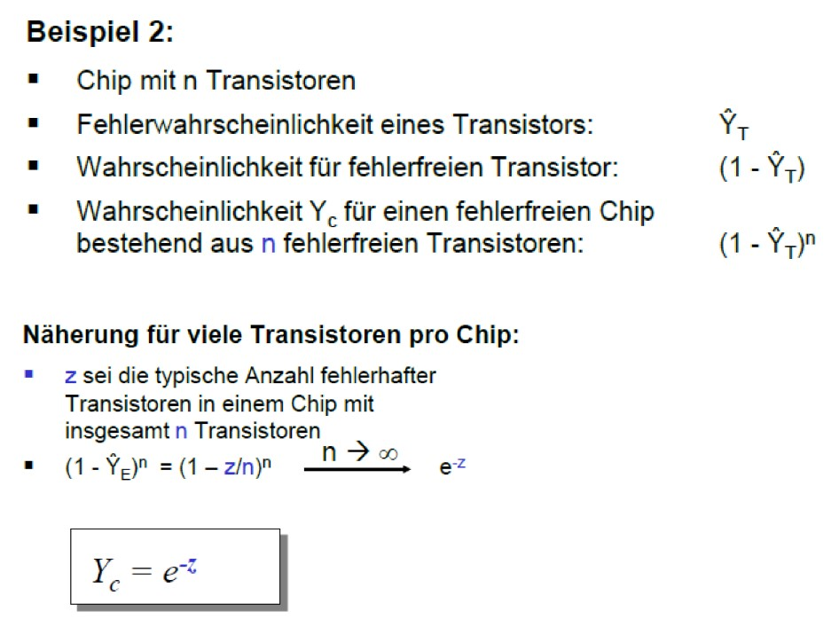

# 1. Einführung in die Mikrosystemtechnik

## 1.1 Elektronenmikroskop

### Was sind die wesentlichen Komponenten bei einem Elektronenmikroskop?
- Elektronenquelle
- Anode (Beschleunigen der Elektronen)
- Magnetische Linse (Fokusierung der Elektronen) 
- Raster Spule (Leitung des Elektronenstrahls)
- Detektor für Sekundär-, Rückgestreute-Elektronen und Röntgenstrahlung

```
Eine Elektronenkanone die Elektronen emittiert, eine Anode zur Beschleunigung der Elektronen, eine elektromagnetische Linse (fokussiert den Elektronenstrahl), eine Rasterspule um den Strahl umlenken zu können (Probe abrastern), eine zu messende Probe sowie Detektoren für Herausgeschlagene Elektronen, reflektierte Elektronen und Röntgen-Strahlung
```

### Wie kommt beim Elektronenmikroskop ein Bild zustande?
Der Elektronenstrahl wird in einem Raster über die Probe geleitet.
Bei jeder Position werden Sekundär-, Rückgestreute-Elektronen und Röntgenstrahlung gemessen.
Aus diesen Daten kann dann ein 2D Bild der Probe berechnet werden.

````
Die oben erwähnten Elektronen und Röntgen-Strahlen können im Detektor erfasst und am Computer ausgewertet werden und daraus schließlich auf die Oberfläche zurückgeschlossen. Mit der Rasterspule wird die gesamte Oberfläche abgerastert (darum der Name).
````

## 1.2 Transistor

### Was ist ein Transistor und wozu ist er gut?
Ein Transistor ist ein elektronisches Bauelement mit 3 Anschlüssen (Source, Gate und Drain) zum steuern und schalten von elektrischen Strömen.

## 1.3 Moores Law

### Was besagt das „Mooresche Gesetz“?
Die Komplexität von integrierten Schaltkreisen verdoppelt sich etwa alle 18 Monate.

### Was bedeutet „Moore than Moore“?
Mehr integrierte Mikrosysteme, statt mehr Rechenleistung.

## 1.4 Pioniere der Mikrosystemtechnik
> Ende der 50-er Jahre hat ein bekannter Mann einen Vortrag gehalten, der heute als eine der Wurzeln der Mikrosystemtechnik betrachtet wird.

### Wie hieß dieser Mann?
Richard Feynman.

### Nennen Sie drei Anwendungen, die er vorhergesagt hat?
1. Mikrochips (Computer mit Drähten die nur noch 100nm breit sind)
2. Informationen sehr kompakt speichern. Beispielsweise „Enzyklopädie auf einen Stecknadelkopf“
3. Elektronenmikroskop

## 1.5 Speicherdichten in Technik und Natur
> Wie groß sind die betreffenden Strukturen sowie die Rastermaße, um bei den nachfolgenden „Speichermedien“ eine Informationseinheit (ein „Bit“) darzustellen? Wie viele Atome werden bei den betreffenden Medien für die Darstellung eines Bits benötigt?

- DVD: Rastermaß: 0,7μm, Atome pro Bit: 10^9
- HDD: Rastermaß: 0,2μm, Atome pro Bit: 10^6
- DNA: Rastermaß: 3nm = 0,003μm, Atome pro Bit: 50

## 1.6 Kleinste Strukturbreiten in der Mikroelektronik

### Was sind in der heutigen Mikroelektronik die kleinsten Strukturbreiten (z.B. für eine elektrische Leiterbahn) die als Standard bei elektrischen Schaltkreisen einsetzt werden?
Aktueller Stand nach VL: 14nm
Samsung 2019: 5nm

## 1.7 Molekulare Maschinen

### Nennen Sie zwei Beispiele für molekulare Maschinen in der Natur.
1. Dupliezieren der DNA bei Zellteilung
2. PH-Pumpen im Blut

## 1.8 Definition Mikrosystemtechnik

### Wie lautet eine der gebräuchlichen Definitionen von „Mikrosystemtechnik“?
Mikrosystemtechnik ist die Wissenschaft der Sensorik, Aktorik und Informationsverarbeitung, mit funktionsbestimmenden Strukturen im Mikrometer Bereich.

### Nennen Sie zwei alternative Begriffe für „Mikrosystemtechnik (bzw. MST)“ beispielsweise im englischen oder asiatischen Sprachraum.
1. MEMS: Micro Electro Mechanical Systems
2. Micromachines

### Was versteht man im Rahmen der Vorlesung unter einem „Prozess“?
Ein Prozess steht für eine vielzahl von Abläufen mit denen Schaltungen oder deren Bauelmente hergestellt werden.

### Was versteht man unter dem Begriff „Elektronisches Bauelement“? Bitte nennen darüber hinaus zwei Beispiele.
Grundbausteine aus denen Schaltungen hergestellt werden.
- Widerstand, Kondensator
- Transistor
- Sensoren

### Was versteht man unter Mikrosystemtechnik-Bauelementen im Rahmen dieser Vorlesung? Bitte nennen darüber hinaus zwei Beispiele.
Mechanische Grundstruckturen aus denen größere Bauelemente wie Sensoren hergestellt werden.
- Membranen
- Plattenkondensator
- Transistor

## 1.8 Meilensteine der Mikrosystemtechnik

### Nennen Sie beispielhaft 4 Mikrosystemtechnik Produkte sowie deren technologischen Treiber, die im Zeitraum 1970 bis 2020 die Entwicklung der Mikrosystemtechnik vorangebracht haben.
1. Der Drehratensensor; Treiber: Automobilindustrie (ESP)
2. Beschleunigungssensor; Treiber: Automobilindustrie (Airbag)
3. Der Tintenstrahldruckkopf; Treiber: die Möglichkeit Fotos farbig ausdrucken zu können
4. DMD Chip; Treiber: Wunsch Kinofilme zuhause anschauen zu können

## 1.9 Mikrosystemtechnik – Produkte in der Medizin

### Nennen Sie mindestens 2 Mikrosystemtechnik-Komponenten zusammen mit den dazugehörigen Anwendungsbeispielen in der Medizin
1. Herzschrittmacher mit integriertem Defibrillator
2. Google Smart Lens, Kontaktlinse für Diabetiker. Misst den Blutzucker und schickt die Daten auf einem Smartphone

## 1.10 Mikrosystemtechnik – Produkte aus dem Bereich „Computer & Informationstechnik

### Nennen Sie mindestens 2 Mikrosystemtechnik-Komponenten zusammen mit deren Einsatzgebiet aus dem Bereich „Computer & Informationstechnik“
1. Fingerabdruckleser bei Smartphones
2. Beschleunigungssensor bei Wii Fernbedienungen

## 1.11 Mikrosystemtechnik – Produkte aus dem Bereich „Automobilindustrie“

### Nennen Sie mindestens 3 Mikrosystemtechnik-Sensoren zusammen mit deren Einsatzgebiet aus dem Bereich der „Automobilindustrie
1. Beschleunigungsensor (Airbag)
2. Drehratensensor (ESP)
3. Drucksensor (Reifendruck)


# 2. Silizium

## 2.1 Silizium als Standardmaterial der Mikrosystemtechnik
> Silizium hat sich zum Standardmaterial in der Mikroelektronik und der Mikrosystemtechnik entwickelt.

### Nennen Sie mindestens 3 Gründe dafür, warum sich Silizium in der Mikroelektronik durchgesetzt hat.
1. Halbleiter
2. Es liegt in Massen vor
3. Preiswerte Fertigungs-Möglichketien

### Nennen Sie mindestens 2 weitere Gründe, warum sich Silizium auch in der Mikrosystemtechnik etabliert hat.
1. Bestens durch Mikroelektronik erforscht
2. Dreidimensionale Strukturierung durch Ätzverfahren
3. Elastizität

## 2.2 Periodensystem

### In welcher Hauptgruppe (Spalte) und in welcher Periode (Zeile) steht Silizium im Periodensystem?
3. Periode, 4. Hauptgruppe

### Nennen Sie die Elemente, die über & unter Silizium bzw.
Drüber: Kohlenstoff, drunter: Germanium

### Nennen Sie die Elemente, links & rechts von Silizium stehen
Links: Al, Rechts: Phosphor


## 2.3 Chemische Daten Silizium

### Nennen Sie die nachfolgenden, chemischen Daten von Silizium: Schmelzpunkt, Siedepunkt, Atomordnungszahl, Anzahl der Valenzelektronen
Schmelzpunkt: 1683K
Siedepunkt: 3553K
Atomordnungszahl: 14
Anzahl der Valenzelektronen: 4

## 2.4 Chemische Daten Silizium

### Welches Kristallgitter besitzt Silizium und wie sind die Elektronen Atome im Kristallgitter angeordnet?
Zwei kubische-flächenzentrierte Gitter die ineinander gestellt um ¼ ihrer Raumdiagonalen verschoben sind. Die Äußeren Atome sind zu einem Würfel angeordnet.

## 2.5 Siliziumverbindungen

### Nennen Sie drei der wichtigsten Siliziumverbindungen und dazu jeweils zwei typische Anwendungsfelder.
1. Siliziumoxid (SiO2); Anwendungen: Elektrischer Isolator, Ätzstoppschicht
2. Siliziumnitrid (Si3N4); Anwendungen: Elektrischer Isolator, Maskierungsschicht
3. Siliciumcarbid (SiC); Anwendungen: Schleifmittel, Maskierungungsschicht

## 2.6 „Millersche Indices“

### Wie lautet die Bildungsregel für die sogenannten „Millerschen Indices“?
1. Berechne die Achsenabschnitte der gesuchten Ebene als Vielfache der Gittervektoren a1, a2, a3
2. Bilde die Kehrwerte der erhaltenen Werte (Kehrwert =0)
3. Multipliziere die Nenner mit dem kleinsten gemeinsamen Nenner, um ganzzahlige Werte h,k,l zu erhalten

## 2.7 Benennen Sie die nachfolgend eingezeichnete Kristallebene


## 2.8 Kennzeichnung der Wafer durch Flats

### Welche „Flats“ kennzeichnen einen p-dotierten Wafer mit (100) Waferoberfläche?
"Primary Flat" dient als mechanische Anlegekante zur Ausrichtung des Wafers (der Flat zeigt in <110> Richtung)

### Welche „Flats“ kennzeichnen einen n-dotierten Wafer mit (100) Waferoberfläche?
"Secondary Flat" dient in Kombination mit dem "Primary Flat" zur
Kennzeichnung der Kristallorientierung

## 2.9 Schnittwinkel der Kristallebenen bei Silizium

### Unter welchen Winkeln schneidet die Gruppe aller äquivalenten {111} Ebenen eine (100) Waferoberfläche?
54,74°

### Unter welchen Winkeln schneidet die Gruppe aller äquivalenten {111} Ebenen eine (110) Waferoberfläche?
35,26° und 90°

## 2.10 Elastizität von Silizium

### Welches Gesetz beschreibt im eindimensionalen Fall den Zusammenhang zwischen der Längenänderung eines Materials und der dafür notwendigen mechanischen Spannung (nennen Sie bitte Name und Formel).
Hooke’sches Gesetz: 


- o = Zug-/Druckspannung
- E = Elastizitätsmodul
- delta(l) = Längenänderung
- l_0 = Länge

### Nennen Sie jeweils Richtwerte für den Elastizitätsmodul und die Bruchspannung von Silizium.
- E-Modul: 130GPa-190GPa
- Bruchspannung:
    - Bulk: 7GPa
    - Polierten Balken: 1,5GPa
    - Membranen: 1GPa

## 2.11 Physikalische Effekte
> Erläutern Sie welche physikalischen Effekte man unter den folgenden Begriffen versteht:

### Piezoeffekt
Das Auftreten einer elektrischen Spannung bei mechanischer Spannung.

### Elektrostriktion
Das Auftreten einer mechanischen Spannung, bei elektrischer Spannung.

### Piezoresistivität
Die Änderung des elektrischen Widerstands bei mechanischer Spannung.
(Bei si liegt nur Piezoresistivität vor.)

## 2.12 Thermische Eigenschaften

### Vervollständigen Sie die nachfolgende Formel zur Berechnung der Wärmestromdichte jQ und führen Sie dabei die thermischen Leitfähigkeit λ ein: jQ = ...
jQ = -λ (dT/dz) (Fourie’sches Gesetzt)

- jQ: Wärmestromdichte (Leistung pro Fläche)
- Q: J/s ohne Fläche
- λ: Thermische Leitfähigkeit (W/(m*K))
- T: Temperatur
- z: Abstand

### Vergleichen Sie die thermische Leitfähigkeit von Silizium ganz grob mit den thermischen Leitfähigkeiten der folgenden Materialien: (i) Aluminium, (ii) Glas, (iii) Silizium Nitrid (Si3N4)
Glas (1) < Silizium Nitrid (2.5) < Si (150) < Al (230)

### Welche der genannten Materialien (Si, Al, Glas, Si3N4) wählen Sie, wenn Sie (i) Wärme möglichst effizient ableiten wollen bzw. (ii) Wärme möglichst effektiv isolieren wollen?
Al für (i), Glas für (ii)

## 2.13 Thermische Längenausdehnung

### Welches Gesetz beschreibt im eindimensionalen Fall den Zusammenhang zwischen der Längenänderung eines Materials und der dafür notwendigen mechanischen Spannung (nennen Sie bitte Name und Formel).
s.o.

### Vergleichen Sie den linearen Temperaturausdehnungs- Koeffizienten Si von Silizium ganz grob mit den entsprechenden Koeffizienten der folgenden Materialien: (i) Aluminium, (ii) Glas
Si (2,5) < Glas (3) < Al (25)

### Welche der genannten Materialkombinationen erzeugt bei Temperaturänderungen die geringsten mechanischen Spannungen?
Si + Glas

## 2.14 „Thermoelektrischer Effekt“

### Was ist der „Thermoelektrische Effekt“ und wie kommt er zustande? Wie können Sie erreichen, dass aufgrund des „Thermoelektrischen Effektes“ dauerhaft ein Strom fließt?
Der Thermoelektrische Effekt ist das Auftreten einer elektrischen Spannung, wenn zwei Punkten eines Leiters (z.B.) Draht unterschiedliche Temperaturen anliegen. Der Effekt kommt zustande das die Elektronen vom heißen Teil ins kältere diffundieren.  
Die Kontaktspannung ist also die Differenz der beiden Ferminiveaus der Materialien.  
Man kann dauerhaft Strom fließen lassen, indem man je ein Material A, dann Material B und dann wieder Material A verbindet, und A dann auf eine andere Temperatur als B bringt.  

## 2.15 Absorption von Licht

### Welche Energie ist notwendig um bei Silizium ein Elektron vom Valenzband in das Leitungsband zu heben? Welcher Wellenlänge des Lichtes entspricht in etwa diese Energie?
1,12ev, 1107nm

## 2.16 Leitungs- und Valenzband
- Valenzband: höchstes vollständig besetztes Energieband beim absoluten Nullpunkt.
- Leitungsband: Das Energetisch darüber liegende Band

## 2.17 Bändermodell bei Halbleitern

### Wie heißt das energiereichste Band, welches beim Halbleiter bei tiefen Temperaturen voll besetzt ist?
Valenzband

### Wie heißt das energieärmste Band, welches beim Halbleiter bei tiefen Temperaturen nicht mehr besetzt ist?
Leitungsband

## 2.18 Dotierung

### Was versteht man unter Dotierung ganz allgemein?
Dotieren bezeichnet das gezielte Verunreinigung eines (kristallinen)Ausgangsmaterials, mit geringen Mengen von Fremdatomem, welche die (elektrischen) Eigenschaften stark verändern.

### Was ist n- bzw. p-Dotierung?
- n- Dotieren: Dotieratom aus der 5. Hauptgruppe geben ein Elektron ab (Donatoren) z.B. Arsen (As) oder Phosphor (P)
- p- Dotieren: Dotieratom aus der 3. Hauptgruppe fangen ein Elektron ein (Akzeptoren) z.B. Bor (B) oder Gallium (Ga)

## 2.19 Was beschreibt die Fermiverteilung?
Die Fermiverteilung gibt die Wahrscheinlichkeit für ein Fermion an, ob ein Energieniveau E bei Temperatur T besetzt ist oder nicht.

## 2.20 Was sind im n-Typ Halbleiter …

- Majoritätsladungsträger: Elektronen
- Minoritätsladungsträger: Löcher

### In welcher Richtung ist das Ferminiveau beim n-Typ Halbleiter verschoben (Leitungsband oder Valenzband)?
Richtung Leitungsband

## 2.21 Anzahl der Elektronen im Leitungsband

###  lautet die Formel, mit der man die Anzahl der Elektronen im Leitungsband berechnet kann, wenn man die Zustandsdichte und das Ferminiveau kennt?
integral n(E)W(E) dE

## 2.22 Optische Transmission

### Erläutern Sie, warum Silizium-Membrane im Bereich von 1 μm bis 20 μm Dicke bei Betrachtung im Durchlicht unterschiedliche Farben haben?
Weil Silizium unterschiedliche Lichtwellen verschieden stark absobiert. Desto dicker die Silizium-Membrand
desto dunkelröter erscheint sie im Durchlicht.

## 2.23 Zonenziehen und Reinigung durch Segregation

### Wie funktioniert die Reinigung eines Siliziumkristalls durch „Segregation“? Beschreiben Sie darauf aufbauend das „Zonenziehverfahren“ für die Herstellung großer einkristalliner Siliziumstäbe.
Der Segregation gibt das der Konzentration Verhältnis eines Stoffes in fester Phase zur flüssigen an. Beim Übergang von der Schmelze zur festen Phase bleiben daher Stoffe, deren Segregationskoeffizient < 1 ist in der Schmelz zurück. Beim Zonenziehverfahren wird der Kristall zonenweise mit Spulen geschmolzen, kristallisiert zum Einkristall und lässt Verunreinigungen in der Schmelze zurück.

## 2.24 Nennen und erläutern Sie mindestens 3 verschiedene Typen von Waferfehlern
1. Parallelitätsabweichung: Unterschiedliche Dicken am Anfang und am Ende des Wafers bzw. die Oberfläche ist nicht parallel zur Unterfläche
2. Welligkeit (lokale Dickevariation): Nicht Bodenparallel, glatt oder eben
3. Fehlorientierung der Flats: Die Fehlorientierung des Flats gegen die Kristallrichtung liegt bei Standardwafern um ± 0,3°


# 3. Bauelemente und Prozessfamilien

## 3.1 Oberflächen- und Volumenkräfte

### Was sind Oberflächenkräfte?
Sind äußere Kräfte, die nur an der Oberfläche eines Körpers angreifen
- Reibungskraft

### Was sind Volumenkräfte?
Greifen an jedem Punkt eines Körpers an, also auch im Inneren des Körpers 
- Gravitation
- Trägheit

### Wie skaliert das Verhältnis aus Oberflächen - und Volumenkräften bei der Miniaturisierung (also wenn man z.B. von den Makro- in die Mikrodimensionen geht)?
1. Volumen (und damit Volumenkräfte) nehmen mit der 3-ten Potenz ab
2. Oberflächen (und damit Oberflächenkräfte) nehmen nur mit 2-ten Potenz ab
3. Oberflächenkräfte sind in kleinen Dimensionen wichtiger als Volumenkräfte

## 3.2 Mechanische Grundstruktur „Membran“

### Wozu werden Membrane bzw. dünne Platten in der Mikrosystemtechnik eingesetzt?
1. Druckwandler: Barometer (wandelt Druckbelastung in mechanische Spannung, die wiederum elektrisch ausgelesen wird)
2. Mechanische Verdränger: Pumpe (verformt sich unter Druckbelastung und verdrängt Medien auf der anderen Seite)

## 3.3 Mechanische Grundstruktur „Plattenkondensator“

### Warum hat der Plattenkondensator in der Mikrotechnik eine deutlich höhere Bedeutung als in der Makrotechnik?
1. Er ist einfach in der Fertigung
2. Kleine Plattenabstände sind realisierbar
3. Beruht auf Oberflächeneffekt

### Nennen Sie ein kommerzielles Produkt, bei dem ein Plattenkondensator in der Mikrosystemtechnik zum Einsatz kommt
DMD Chip

## 3.4 Mechanische Grundstruktur „Biegebalken“

### Skizzieren Sie bei einem Balken, der links und rechts unterlegt und in der Mitte belastet ist:


## 3.5 Mechanische Grundstruktur „Kamm-Aktuator“

### Skizzieren Sie einen Kammaktuator in der Draufsicht und zeichnen Sie i) die Richtung der Normalkraft sowie ii) die Richtung der Tangentialkraft ein


### Wie skaliert die Tangentialkraft mit .. i) angelegter Spannung U ii) Anzahl N der Finger iii) der Höhe h des Kammes iv) dem Abstand d der Finger v) der Verschiebung in Tangentialrichtung


1. wächst quadratisch mit U
2. wächst linear mit Anzahl der Finger (Proportional zur Fingerzahl jeder
Kammseite)
3. wächst linear mit Kammhöhe
4. umgekehrt proportional zum Fingerabstand
5. unabhängig von der Tangentialverschiebung

### Nennen Sie zwei kommerzielles Produkte, bei denen Kamm-Strukturen in der Mikrosystemtechnik zum Einsatz kommen
1. Siliziummikrophon
2. Drehratensensor 

## 3.6 pn-Übergang im Gleichgewicht

### Was ist ein pn-Übergang?
Materialübergang in Halbleiterkristallen zwischen Bereichen mit entgegengesetzter Dotierung.

### Was passiert, wenn man p- und n-dotierte Halbleiter in Kontakt bringt an der Grenzfläche? Welche Rolle spielen frei bewegliche Ladungsträger und Dotieratome?
Bringt man p- und n-dotierte Bereiche in Kontakt, diffundieren die frei beweglichen Ladungsträger in das jeweils andere Material, die ortsfesten Ionen der Dotieratome bleiben zurück. Die Ladungsträger rekombinieren dort mit dem jeweils anderen Ladungsträgertyp.

### Was versteht man unter einer „Raumladungszone“ und der „Diffusionsspannung“?
Die zurückbleibenden ortsfesten Ionen der Dotieratome verursachen ein elektrisches Feld E, welches eine (Gegen-) Kraft auf die verbleibenden freien Majoritätsladungsträger ausübt, d.h. Elektronen im n-Typ Halbleiter werden durch die ortsfesten, negativen Ionen der Raumladungszone im p-Typ Halbleiter abgestoßen. Diesen Raumbereich nennt man Raumladungszone.
Die zuvor elektrisch neutralen Kristalle haben durch die zurückbleibenden, festen Ladungen nunmehr eine Raumladung erhalten, die im p-Kristall einen negativen und im n-Kristall einen positiven Pol erzeugt. Die dadurch entstandene Spannung nennt man Diffusionsspannung.

### Nennen Sie 3 typische Anwendungen für pn-Übergänge in der Mikrosystemtechnik bzw. Mikroelektronik
1. Transistoren
2. Solarzellen
3. Light Emmiting Diode

## 3.7 Halbleiter-Diode
Skizzieren Sie für einen pn-Übergang die Polarität der von außen anzulegenden Spannung, wenn die Diode in Durchlassrichtung betrieben werden soll.


### Vergrößert oder verkleinert sich in diesem Fall die Raumladungszone gegenüber dem pn-Übergang im Gleichgewicht ohne äußere Spannung?
Bei Betrieb in Durchlassrichtung verkleinert sich die Raumladungszone.

## 3.8 Transistor

### Skizzieren Sie den Querschnitt eines n-Kanal Metall-Oxid-Halbleiter-Feldeffekttransistor (MOSFET).


### Was unterscheidet einen ionenselektiven Feldeffekt Transistor (ISFET) von einem typischen MOSFET?
In einem ISFET hat am Gate keine Metallelektrode sondern eine Ionensenistive Schicht: statt eine Spannung anzulegen können sich hier Ionen ansammeln.

## 3.9 Prozessfamilie BULK-Mikromechanik

### Was versteht man unter BULK-Mikromechanik?
Eine Prozessfamilie in der Mikrosystemtechnik, in der Strukturen durch Ätzverfahren aus dem Wafer herausgeätzt werden. Die herausgeätzen Strukturen bestehen aus Einkristall.

### Nennen Sie ein typischen Produkt der Mikrosystemtechnik, welches in der Regel in BULK-Mikromechanik gefertigt wird
- Mikromembranpumpe
- Drucksensor

## 3.10 Prozessfamilie Oberflächenmikromechanik

### Was versteht man unter Oberflächenmikromechanik?
Eine Prozessfamilie der der MST, in der Strukturen additiv auf dem Wafer aufgebracht werden. Die Funktionssschichten werden i.d.R. aus polykristallinen Material hergestellt.

### Welche Rolle spielt dabei die „Opferschicht“ (engl. „Sacrificial layer“)
Opferschichten dienen als Distanzschicht und definieren den Abstand der Funktionsschicht vom Substrat.

### Nennen Sie 3 typische Produkte der Mikrosystemtechnik, die in der Regel in Oberflächenmikromechanik gefertigt werden
1. Beschleunigungssensor
2. Drehratensensor
3. Silizium-Kondensatormikrofon

## 3.11 Prozessfamilie CMOS Technologie

### Wofür steht der Begriff „CMOS“?
Wörtlich: Complementary Metall Oxid Semiconductor.

### Was versteht man unter „CMOS-Technologie“?
Steht heute für verwendeten Halbleiterprozess zur Realisierung von digitalen sowie analogen Schaltungen sowie eine Logikfamilie. Die Schaltungslogik der CMOS-Technologie stellt die meistgenutzte Logikfamilie dar und wird hauptsächlich für ICs genutzt.

## 3.12 DNAe und „Ion Torrent“ Sequencing Technologie

### Beschreiben Sie stichpunktartig, wie das Sequenzieren von DNA durch ionensensitive Feldeffekttransistoren funktioniert.
1. DNA lässt sich zu einem Einzelstrang aufschmelzen
2. Das Enzym „Polymerase“ kann diesen Einzelstrang bei Vorhandensein der Nukleotide wieder zu einem Doppelstrang zusammenfügen
3. Beim Einbau der Nukleotide werden Protonen (H+) freigesetzt
4. Geschieht dies nahe an dem Gate eines Ionensensitiven Feldeffekttransistors, so ändert sich dessen Leitfähigkeit und der Einbau der Nukleotide kann damit detektiert werden

## 3.13 Ablative Mikrobearbeitung

### Nennen Sie mindestens drei Verfahren für die ablative Mikrobearbeitung (auch als subtraktive Mikrobearbeitung bekannt).
1. Wasserstrahlschneiden
2. Sandstrahlschneiden
3. Laserstrahlschneiden

## 3.14 Laserstrahlschneiden

### Was versteht man unter Laserschneiden?
Laserschneiden (Laserstrahlschneiden) bezeichnet das Durchtrennen von Festkörpern mittels kontinuierlicher oder gepulster Laserstrahlung durch Materialablation.

### Welche Werkstoffe können damit bearbeitet werden?
Nahezu jede Art von Werkstoff, beispielsweise Metalle, Dielektrika und organische Materialien können nach dem Stand der Technik mit Laserstrahlung geschnitten werden.

### Über welche Prozessparameter lässt sich der Prozess steuern?
- Wellenlänge
- mittlere Leistung
- Pulsenergie
- Pulsdauer

## 3.14 Ionenstrahlschneiden (FIB-SEM bzw. Focused Ion Beam – Scanning Electron Microscope technology)

### Wie funktioniert das Strukturieren durch FIB?
- FIB (focused ion beam): Materialabtrag durch Beschuss der Probe mit Ionen
- SEM (scanning electron microscope): Abbild der freigelegten Oberfläche
- Durch Kombinationen aus FIB und SEM kann die Oberfläche dann schrittweise geschnitten und strukturiert (und ausgewertet) werden.

### Welche Auflösung (kleinste Strukturen) lassen sich damit erreichen?
\> 5nm, Materialabhängig

## 3.15 3D-Druckverfahren

### Was versteht man unter 3D-Druck?
3D-Druck ist eine Bezeichnung für alle Fertigungsverfahren bei dem Material Schicht für Schicht aufgetragen und so dreidimensionale Gegenstände (Werkstücke) erzeugt werden.

### Nennen Sie mindestens 3 gebräuchliche Verfahren
1. Stereolithografie
2. Laser-Strahlschmelze
3. Elektronen-Strahlschmelze

## 3.16 Direct laser writing mit 2-Photonen Absorption

## Was ist das Besondere am Laser-Direct-Writing mit 2 Photonen Absorption?
1. Das zu polymerisierende Material darf optisch transparent sein
2. Licht wird ausschließlich an den Stellen höchster Strahlintensität absorbiert (nur dort ist die Wahrscheinlichkeit, dass zwei Photonen gleichzeitig absorbiert werden ausreichend hoch)
3. Pixelgröße des polymerisierten Materials ist kleiner als die Fokusgröße des Laserstrahls

Gut geeignet für Linsen (klein und transparent)

# 4. Reinraumtechnik

## 4.1 Ausbeutebetrachtung I

###  Wafer wird in Prozessschritten hergestellt. Jeder einzelne Prozessschritt wird mit einer Ausbeute Ysi beherrscht. Wie berechnet sich die Gesamtausbeute an fehlerfrei prozessierten Wafern?


## 4.2 Ausbeutebetrachtung II

### z sei die typische Anzahl fehlerhafter Transistoren auf einem Chip mit insgesamt n Transistoren. Geben Sie die Formel zur Berechnung der Ausbeute korrekter Chips an.


## 4.3 Ausbeutebetrachtung III

### D sei die Fehlerdichte pro Flächenelement. Geben Sie die Formel zur Berechnung der Ausbeute korrekter Chips in Abhängigkeit der Chipfläche Ac an.


### Geben Sie zwei Gründe dafür an, warum bei einer definierten Fehlerdichte D pro Flächenelement ein kleiner Chip kostengünstiger ist als ein großer.
1. Aus a) folgt das die Ausbeute steigt
2. Können mehr Chips gleichzeitig hergestellt werden

## 4.4 Ausbeutebetrachtung IV

### Eine Reduktion der Ausbeute ist üblicherweise verbunden mit auftretenden Fehlern. Nennen Sie mindestens zwei der üblichen Fehlerquellen zusammen mit deren Auswirkungen.
1. Partikelbehaftete Störungen (z.B. Staubpartikel in Lithografie)
2. Entstehung undefinierte Oberflächen (monomolekulare Schichten wie z.B. Oxide oder adsorbierte Atome der Umgebung; erstere verschlechtern elektrische Kontaktierung)

## 4.5 Reinraumklassen I

### Was macht einen Reinraum aus bzw. welche Parameter werden extrem gut kontrolliert? Nennen Sie mindestens 4 Parameter.
1. Partikelbelastung
2. Raumtemperatur
3. Luftfeuchtigkeit
4. Luftdruckt
5. Spektrale Zusammensetzung des Lichts (z.B. bei Räumen mit Fotoempfindlichen Chemikalien Gelbräume)
6. Sterilität

### Zählen Sie die Ihnen bekannten nationalen bzw. internationalen Standards für Reinraumklassen auf.
1. US Federal Standard 209b
2. DIN EN ISO 14644
3. VDI-Standard 2083

## 4.6 Reinraumklassen II

### Nennen Sie ein Zahlenbeispiel für die erlaubte Partikelkonzentration für eine Reinraumklasse und einen Reinraum-Standard Ihrer Wahl
US Federal Standard 209b Class 100. 100 Partikel > 5μm pro foot³.

## 4.7 Aufbau eines Reinraums

### Skizzieren Sie einen typischen Grundriss eines Reinraums (Draufsicht) sowie die Aufstellung von Partikel erzeugenden Anlagen. 


### Skizzieren Sie einen typischen vertikalen Aufbau eines Reinraums (Schnitt in vertikaler Richtung).


## 4.8 Reduktion der Partikelbelastung

### Nennen Sie mindestens 3 Möglichkeiten, wie sich die Auswirkungen der Partikelbelastung auf die prozessierten Wafer in einem Reinraum reduzieren lassen
- stetiger Austausch partikelreicher Luft mit partikelarmer Luft
- Betrieb partikelerzeugender Anlagen/Prozesse im Grauraum
- Richtiges Verhalten des Personals/Studenten im Reinraum
- Prozessführung in Flüssigkeiten und Vakuum

## 4.9 Laminar Flow

### Warum wird durch „laminar Flow“ die Kontamination der Wafer mit Partikel reduziert
Partikelbelastete Luft wird von der partikelarmen Luft verdrängt und durch gelochten Boden entlang den Stromlinien abgeführt. Alle Strömungslinien sind von oben nach unten gerichtet. Eine Ausbreitung der Partikel quer zur Strömung ist nicht möglich.

### Wie groß ist die Strömungsgeschwindigkeit beim Laminar Flow?
ca. 0.45 ± 0.05 m/s (grad so keine Turbulenzen)

## 4.10 Turbulente Mischströmung

### Nennen Sie Vor- und Nachteile der „Turbulenten Mischströmung“ gegenüber dem „Laminar Flow“ zur Herstellung einer guten Reinraumklasse
- Vorteil: Preiswerter als Laminar Flow
- Nachteil:
  - Die Verweildauer der partikelbelasteten Luft ist wegen turbulenter Strömung größer: erzielte Reinraumklasse ist schlechter
  - Teilchen kommen jeden Bereich im Reinraum erreichen

## 4.11 Reinraumgerechtes Verhalten

### Nennen Sie mindestens 4 Beispiele für reinraumgerechtes Verhalten.
- langsame Bewegung
- wenig Reden (wenn dann weg von substrat/maschienen)
- nur tippen
- Reinraumkleidung korrekt tragen

## 4.12 Typische Betriebsparameter
- Temperatur 22 ± 0,5°C im Arbeitsbereich US-Klasse 10-100
- Temperatur 22 ± 0,1°C in der Lithographie US-Klasse 10-100
- Relative Luftfeuchtigkeit: 45 ± 5%


# 5. Vakuumtechnik

## 5.1 Vakuumdruckbereiche

### In welche Druckbereiche lässt sich Vakuum unterteilen? (Nennen Sie bitte Bezeichnung und Druckbereich).
- Grobvakuum (GV): 10^0 - 10^3 Pa
- Feinvakuum (FV): 10^-3 - 10^0 Pa
- Hochvakuum (HV): 10^-7 - 10^-3 Pa
- Ultrahochvakuum (UHV): < 10^-7 Pa

## 5.2 Modell von Krönig

### Nennen und erläutern Sie einen Ansatz für die vereinfachte Berechnung der Geschwindigkeit von Gasmolekülen als Funktion der Temperatur
- Annahme 1: Jedes Teilchen habe denselben Geschwindigkeitsbetrag
- Annahme 2: Je 1/6 der Teilchen fliegen in oder entgegen den Richtungen x, y und z
- Dann gilt:  


## 5.3 Mittlere freie Weglänge

### Erläutern Sie den Begriff der „Mittleren freien Weglänge“
Teilchen (z.B. Gasteilchen) stoßen in gewissen Abständen miteinander. Weil sie aber immer einen endlichen Abstand haben, legen sie eine Strecke zurück, bevor sie aufeinander stoßen. Die mittlere Freiweglänge ist die im Mittel zurückgelegte Strecke zwischen zwei Stößen.

### Wie hängt die mittlere freie Weglänge qualitativ vom Druck und vom Wirkungsquerschnitt des Teilchens ab?
Die mittlere freie Weglänge steigt mit dem Druck sowie Wirkungsquerschnitt.

### Nennen Sie die Größenordnung der mittleren freien Weglänge von Wasserstoff H2 bei Normalbedingungen
125nm

## 5.4 Knudsen - Zahl Kn

### Wie ist die Knudsen - Zahl Kn definiert? Erläutern Sie die Strömungstypen sowie den dominierenden physikalischen Effekte, welcher bei dem betreffenden Strömungstyp den Durchfluss der Teilchen durch ein Rohr limitiert.
Kn = λ/d, wobei d die charakteristische Abmessung und λ die mittlere freie Weglänge ist.

### für eine Knudsenzahl Kn < 10-2
- λ << d: „Viskose“ Strömung (typisch für Grobvakuum)
- Je nach Reynoldszahl entweder laminar oder turbulent

### für eine Knudsenzahl von Kn > 0,5
- λ > d: „Molekulare“ Strömung (typisch für Hochvakuum):
- Viskosität hat keine Bedeutung mehr
- Teilchen treffen auf Rohrwand und werden dort adsorbiert
- Teilchen bleiben eine gewisse Verweilzeit
- Teilchen desorbieren mit Abstrahlung nach cos-Funktion
- Wahrscheinlichkeit für „Abflug nach links“ ist genauso groß, wie Wahrscheinlichkeit für „Abflug nach rechts“

## 5.5 Physiosorption und Chemisorption
> Wenn Atome auf eine Oberfläche treffen so bleiben Sie mit einer gewissen Wahrscheinlichkeit haften. Erläutern Sie welche Kräfte (a) bei der Physiosorption wirken bzw. (b) bei der Chemisorption. Erläutern Sie die Begriffe anhand eines Diagramms aus dem die Energie des adsorbierten Atoms als Funktion des Abstandes zur Oberfläche ersichtlich ist

### Welche Bindungsenergien treten bei Physiosorption bzw. (b) bei der Chemisorption auf?
- a) Van der Waals Kräfte sowie Adsorptionsenergie
- b) Kovalente Bindung, Aktivierungsenergie  


## 5.6 Monolage und Monozeit

### Wie lange dauert es (ungefähre Größenordnung) bis sich bei normalen Umgebungsbedingungen eine Monolage an Luftmolekülen auf einer Oberfläche bildet?
4ns
### In welchen Druckbereich müssen Sie vorstoßen damit der Prozess etwa 1 Sekunde dauert?
10^-6 mbar

## 5.7 Öl-Diffusionspumpe

### Skizzieren und erläutern Sie das Funktionsprinzip einer Öl- Diffusionspumpe.
- Öl wird Siedegefäß verdampft.
- Die Dämpfe steigen auf
- Die Dämpfe werden durch Düsen wieder nach unten geleitet und beschleunigt.
- Gasmoleküle werden mitgenommen.
- Unterdruck (Vakuum) erzeugt.
- Bis zu 10^-8 Pa sind möglich.
- Ein Vorvakuum ist notwending.


## 5.8 Turbo-Molekularpumpe

### Skizzieren und erläutern Sie das Funktionsprinzip einer Molekularpumpe.
- Hat ein Schaufelsystem wie eine Turbine
- Die mit 10000k U/Min sich drehen
- Ein Vorvakuum ist notwending.
- Überträgt Impulse auf Gasmoleküle um sie in einen Raum mit höherem Druck zu befördern


## 5.9 Kryopumpe

### Skizzieren und erläutern Sie das Funktionsprinzip einer Kryopumpe.
- Extermes Kühlen der Wände des Vakuumbehälters
- Gamolekühle werden in fester Form durch Kondensation niedergeschlagen
- Erzeugung von Hoch- und Ultrahochvakuum möglich


# 6. Einführung in dünne Schichten

## 6.1 „Morphologie“

### Was versteht man unter dem Begriff „Morphologie“ einer dünnen Schicht?
- Gestalt
- Form
- Organisationsprinzip

### Welche beiden Eigenschaften sind für die Qualität einer Schicht entscheidend?
1. Rauhigkeit (Physikalischer Zustand der Oberfläche)
2. Aktivierungsenergie für Oberflächendiffusion und Volumendiffusion

## 6.2 Strukturzonenmodell von Thornton

### Skizzieren Sie das Strukturzonenmodell von Thornton.


### Welche physikalischen Größen bilden die beiden Achsen?
- Partilaldruck der Atmosphäre
- Temperaturkoeffizienten

### Welche Schichteigenschaften betrachtet Thornton in seinem Modell?
- Oberflächendiffusion
- Dichte
- Haftfestigkeit
- innere Spannungen

### Erläutern Sie die einzelnen Strukturzonen. Welche Schichteigenschaften liegen in den einzelnen
#### Zone 1:
1. An Keimstellen wachsen nadelförmige Kristallite
2. Kristallite verbreitern sich durch Einfangen weiterer Atome

Schichteigenschaften:
- Oberflächendiffusion reicht nicht aus um abgeschattete Bereiche auszugleichen (Temperatur zu niedrig)
- Wenig Dicht?
- Schicht ist porös (geringe Haftfestigkeit)
- Hohe innere Spannungen

### Zone T:
1. Adsorbierte Atome können Wirkung der Abschattung zum Teil ausgleichen
2. Basis der Kristallite aus Zone 1 wird verbreitert

Schichteigenschaften: 
- Faserförmige Schichtstruktur. 
- Erhöhte Oberflächendiffusion
- Dichter als Zone 1

### Zone 2:
1. Mit wachsender Substrattemperatur nimmt der Durchmesser der Säulen zu

Schichteigenschaften:
- Schicht hat säulenartige Struktur
- Oberflächendiffusion nimmt stark zu und bestimmt das Wachstum stark mit
- Nochmal Dichter
- Hartfestigkeit wächst

### Zone 3:
1. Wachstum wird durch Volumendiffusion bestimmt
2. Geeigneter Temperaturbereich für Sputtern, CVD, ...

Schichteigenschaften:
- Polykristallines Gefüge
- Hohe Dichte


### Warum und wie hängen die Übergangstemperaturen der einzelnen Zonen von dem Partialdruck ab?
Die Übergangstemperaturen steigen mit wachsendem Druck an.

Effekt:
- Atome stoßen mehr von Gaßatomen ab
- Oberflächenmigration reduziert sich
- Schlechtere Schichtqualität

Nebeneffekt:
- Atomzusammenstöße
- Andere Auftreffwinkel
- Bessere Schichtqualität bei hinreichend großem Druck

## 6.3. Kantendeckung

### Geben Sie für die nachfolgend dargestellten Kantenbedeckungstypen (b), (c) und (d) an, wie die beiden Prozessparameter „Oberflächenbeweglichkeit“ und „Mittlere Freie Weglänge“ gewählt werden müssen, damit sich die dargestellte Kantenbedeckung ergibt.


a) Mittlere Weglänge in Dimension der Gefäßgröße und hohe Oberflächenbeweglichkeit
b) Große mittlere freie Weglänge im Vergleich zur Gefäßdimension, geringe Oberflächenbeweglichkeit
c) Wie b) nur mit kleiner mittleren freien Weglänge

## 6.4 Mechanische Spannungen

### Nennen Sie mindestens 2 Gründe, welche bei der Erzeugung dünner Schichten zu mechanischen Spannungen führen.
1. Hohe Temperatur bei der Abscheidung (Verspannung beim Abkühlen)
2. Intrinsische Spannungen aufgrund des Wachstumsprozesses

## 6.5 Haftfestigkeit

### Nennen Sie mindestens drei physikalische Parameter, welche die Haftfestigkeit einer dünnen Schicht beeinflussen?
1. Prozesstemperatur
2. Prozessdruck
3. Art der Adhäsionswechselwirkung

### Wie funktionieren dagegen „chemische Haftvermittler“?
- Trägermolekül mit zwei oder mehr Liganden
- Baut Haftung and der Grenzfläche auf (Substratmaterial, abgeschiedenes Material)

## 6.6 Klassifikation der Verfahren zur Herstellung dünner Schichten

### Nennen Sie mindestens 7 verschiedene Verfahren zur Herstellung dünner Schichten (Dünnschichttechnik). Ordnen Sie diese Verfahren thematisch zusammengehörigen Klassen zu.
- Abscheiden
  - PVD Prozesse
    - Sputtern
    - Aufdampfen
  - CVD Prozesse
    - CVD
    - LPCVD
    - Epitaxie
- Umwandeln
  - Thermische Oxidation
  - Dotieren


## 6.7 Schichtqualität

### Nennen Sie mindestens 5 Kriterien nach denen man die Qualität eines Prozesses oder die Qualität einer Schicht bewerten kann.
1. Hohe Reinheit 
2. Exzellente Adhäsion
3. Gute Homogänität der Dicke
4. Gute elektrische Eigenschaften
5. Gute Kantenbedeckung
6. Gute Stöchiometrie


# 7 Thermische Oxidation

## 7.1 Thermische Oxidation

### Nennen Sie eine mögliche Reaktionsgleichung für die thermische Oxidation von Silizium.
Si + O2 -> SiO2

### In welchem Temperaturbereich läuft dieser Prozess ab?
800°C-1200°C

### Beschreiben Sie die Teilprozesse bei der „thermischen Oxidation“ auf molekularer Ebene und nennen Sie den Grund der die Herstellung dicker Oxidschichten limitiert.
1. Diffusion des Sauerstoffes / Wassers bis zur Oxidoberfläche
2. Diffusion des Sauerstoffes / Wasserdampf durch das bereits gebildete Oxid bis zur Grenzschicht
3. Chemische Reaktion an der Grenzschicht zwischen SiO2 und Si

Bei einer dickeren Oxidschicht ist es Unwahrscheinlicher, dass der Sauerstoff/Wasserdampf bis zur Grenzschicht diffundiert.

### Was bedeutet LOCOS und wie funktioniert das?
- „Local Oxidation of Silicon“, Lokale Oxidation von Silizium.
- Man kann Stellen, die nicht oxidiert werden sollen, mit Si3N4 pasiveren (Diffusionsperre).
- Oxidation also lokal an den unbeschichteten Stellen.
- Die Passivierschicht kann nach der Oxidation wieder entfernt werden, z.B. mit Ätzverfahren.

## 7.3 Feucht- und Trockenoxidation

### Erläutern Sie bei der thermischen Oxidation die Unterschiede zwischen einer „Feuchtoxidation“ und einer „Trockenoxidation. Nennen Sie dabei die Reaktionsgleichungen, die Prozesstemperaturen und vergleichen Sie die Wachstumsraten.
Si + 2(H2O) -> SiO2 + H2


## 8.1 Dotierung

### Was versteht man unter Dotierung ganz allgemein?
- Gezielte Verunreinigung von kristallinen Materialien
- Mit geringen mengen von Fremdatomen
- Ändert (elektrische) Eigenschaften stark

### Was ist n- bzw. p-Dotierung?
p-Dotierung: Valenzelektronen weniger
n-Dotierung: Valenzelektronen mehr

### Nennen Sie mindestens einen typischen Dotierstoff für ein p- oder n-dotiertes Silizium.
Stoff für p dotiertes Silizium: Bor(loch)
Stoff für n dotiertes Silizium: Phosphor

## 8.2 Auswirkung von Goldatomen

### Welche Auswirkungen haben Goldatome, welche in das Silizium Kristallgitter eingebaut sind?
Die Goldatome stellen Rekombinationszentren dar, d.h. fördern die Rekombination von Löchern und Elektronen (was u.a. für Solarzellen schädlich und unerwünscht ist).

## 8.3 Dotierverfahren

### Zählen Sie mindestens 4 Dotierverfahren auf.
- Diffusion
- Ionenimplantation
- Epitaxie (Als Gas beim Wachstum hinzugefügt)
- Dotierung beim Kristallziehen (gleichmäßig)
- Legieren (Aufschmelzen)

## 8.4 Diffusion aus erschöpflicher Quelle
a) Erläutern Sie die Diffusion aus einer erschöpflichen Quelle und skizzieren Sie den
- Dünne Schichten mit Dotieratomen werden auf der Oberfläche des Kristalls aufgebracht
-  Sie diffundieren solange in den Kristall, bis der Dotierstoff aufgezehrt ist.
-  Die Konzentration der Dotierstoffe sinkt an der Oberfläche laufend ab.

Konzentrationsverlauf des Dotierstoffes im Inneren des Siliziumkristalls zu verschiedenen
Zeitpunkten.


### Welcher charakteristischen Funktion entspricht dieser Verlauf?
Gaußförmiger Funktionsverlauf

### Wie errechnet sich die Eindringtiefe?
- sqrt(Dt): Diffusionslänge
- D: Diffusionskonstante
- t: Zeit

## 8.5 Thermische Diffusion

### Erläutern Sie die Vor- und Nachteile der thermischen Diffusion.
- Vorteile:
Günstiger Prozess (Batchgröße typisch 50 Wafer)
Nachteile:
1. Tiefe (einige Mikrometer)
2. homogen dotierter Schichten ist problematisch (Prozess beruht auf Konzentrationsgradienten)
3. niedrig dotierter Schichten ist problematisch (nur geringe Konzentrationsgradienten)

## 8.6 Ionenimplantation

### Beschreiben Sie die bei der Dotierung durch Ionenimplantation auftretenden Teilprozesse
1. Ionisierung der Dotierstoffe
2. Beschleunigung der Dotierstoffe
3. Einschießen in den Kristall
4. Abbremsen der Ionen erfolgt durch physikalische Prozesse
5. Ausheilen (Aktivieren)

### Welche Funktion beschreibt das Dotierprofil in z-Richtung?
- Näherungsweise gaußförmig. Es beschreibt die Tiefe der eingetretenen Ionen

### Wie groß ist die typische mittlere Eindringtiefe?
10nm – 1000nm

### Was versteht man unter Streubirne?
- Birnenförmiger Einwirkungsbereich der Streuung.
- Beschrieben durch die mittlere Reichweite, Streubreite und laterale Abweichung.

### Was versteht man unter „Channeling“ und mit welchen Methoden kann man das Verhindern?
Elektronen können durch die Kanäle von Kristallen um bis zu einer Größenordnung weiter ausbreiten.

Unterbindungsmöglichkeiten:
1. Herausdrehen des Kristalls aus Einschusswinkel um 7°-10°
2. Abscheidung einer amorphen Oberflächenstreuschicht -> Diffuse Streuung des Ionenstrahls
3. Einschuss einer Amorphisierungsdosis (Oberflächennahe Kristallordnung wird zerstört und es kommt zur diffusen Streuung des Ionenstrahls)

## 8.7 Ionenimplantation

### Erläutern Sie die Vor- und Nachteile der Ionenimplantation.
Vorteile:
1. **Exakte Kontrolle** der Dotier-Dosis durch Integration über den Ionenstrom möglich
2. **Niedertemperaturprozess** ermöglicht Maskierung durch Photoresist
3. Implantationszeiten im Bereich von Sekunden bis Minuten ermöglichen **vernünftigen Durchsatz**
4. Massenseparator stellt **Reinheit** des Dotierstoffes sicher
5. Dotierprofile bei Ionenimplantation haben **steilere Flanken** (Abgrenzung)
6. **Variation Dotierprofil** durch Variation der Einschussenergie
7. Maximum der Dotierkonzentration liegt **„vergraben“**

Nachteile:
1. Nur in **oberflächennahen** Bereichen anwendbar (bis circa 1 μm)
2. Schäden können entstehen (Annealing (heiß machen) kann i.A. Versetzungen, Defekte und amorphe Bereiche, die durch Strahlenschäden verursacht wurden, nicht vollständig beheben)

## 8.8 Annealing-Schritt

### Weshalb benötigt man nach der Dotierung durch Implantation einen Annealing-Schritt?
Tempern: Die Dotieratome auf Zwischengitterplätzen müssen in das reguläre Gitter eingebaut werden, was mit Hilfe von Anneailing erreicht werden kann, d.h. man aktiviert die Dotierstoffe elektrisch.

# 9. Physical Vapor Deposition 

## 9.1 Aufdampfen

### Beschreiben Sie die drei Teilprozesse beim Aufdampfen
1. Thermisches Verdampfen des Materials bei 1000-3500C
2. Dampfteilchen steigen auf bis zum Substrat
3. Kondesation am Substrat/Wände

### Warum ist das Aufdampfen von Legierungen manchmal problematisch und wie löst man es trotzdem?
- Die Bestandteile einer Legierung haben oft verschiedene Dampfdrücke (Verdampfungsraten)
- Die Aufgedampfte schicht wird anders sein als die originale Legierung
- Lösung: Je eine Verdampfungsquellen pro Legierungskomponent

### Nehmen wir an, ein Wafer wird unter dem Winkel Φ zum Verdampfer in die Anlage eingebaut und die zu bedampfende Oberfläche ist zur Waferoberfläche um den Winkel θ geneigt. Um welchen Faktor ist die Schichtdicke der zu bedampfenden Oberfläche reduziert gegenüber der Schichtdicke, die der Schwingquarz detektiert
cosΦcosθ

## 9.2 Sputtern (Kathodenzerstäuben)

### Skizzieren Sie den Aufbau einer Sputteranlage und nennen Sie 4 Teilprozesse beim Aufbringen einer dünnen Schicht durch Sputtern.


1. Ionen werden gezeugt
2. Ionen werden von Kathode angzogen
3. Ionen schlagen in Target Material auf
4. Target Atom wird Herausgeschlagen (haben hohe Energie)
5. Target Atom landet auf Wafer (als feien Stäube)

### In welcher Hinsicht unterscheiden sich die auf das Substrat auftreffenden Atome des abzuscheidenden Materials beim Sputtern und beim Aufdampfen?
Sputtern:
- Wesentlich mehr Energie 
- Beliebige Raumrichtung

## 9.3 Prozessvarianten des Sputterns (Kathodenzerstäuben)

### Erläutern Sie kurz und prägnant die Bedeutung der nachfolgenden Prozessvarianten des Sputterns und nennen Sie jeweils ein typisches Einsatzgebiet für die betreffende Prozessvariante.
#### DC-Sputtern:
- Target muss elektrisch leitfähig sein
- Metalle und Halbleiter

#### AC-Sputtern:
- Sputtern mit Wechselspannung
- Alle Materialien

#### Sputterätzen:
- Mit umgekehrter Polarität wird das Substrat wird Abgesputtert
- Um Metalloberflächen zu reinigen

#### Bias-Sputtern:
- AC-Sputtern mit überlagerter, externer Gleichspannung
- Ionen bombardieren auch das Substrat und tragen schlechthaftende Atome und Atome des Inertgases ab
- Höhere Dicht
- Bessere Kantenbedeckung

#### Reaktives-Sputtern:
- Es gibt mindestens ein Reaktives Gas
- Reagiert mit Target/Substrat, bildet neue Materialien
- Neue Materialien auf Substrat
- Wird für Nitrid-Schichten benützt

#### Magnetron-Sputtern:
1. Magnetisches Feld erhöht Verweildauer der Elektronen im Plasma
2. mehr Stöße mit Prozessgas
3. höherer Ionisierungsgrad und Abscheiderate um eine Größenordnung höher

## 9.4 Sputtern vs. Aufdampfen

### Was sind die Vorteile bzw. Nachteile des Sputtern (Kathodenzerstäuben) gegenüber dem Aufdampfen?
Vorteile:
- Besser Kontrollierbar
- Legierungen funktionieren gut
- Höhere Dichten und Bessere Kantenabdeckung
- Alle Materialien sind geeignet
- Ermöglicht integrierte Reinigung (Sputterätzen)

Nachteile:
- Teuer
- Aufwendiger
- Hohe Prozessdrücke -> Gaseinschluss

# 10. CVD: Chemical Vapor Disposition

## 10.1 Heterogener CVD – Abscheideprozess

### Skizzieren und erläutern Sie die 7 Teilschritte bei einem heterogenen CVD – Abscheideprozess. Was limitiert typischerweise die Rate des Schichtwachstums?
1. Erzwungene Konvektion zum Transport der Reaktanten zur Abscheide-Region 
2. Diffusion durch die Grenzschicht zur Substratoberfläche
3. Adsorption der Reaktanten
4. Oberflächenreaktion
5. Desorption der Reaktionsnebenprodukte
6. Diffusion durch die Grenzschicht
7. Erzwungene Konvektion zum Abtransport der Reaktionsnebenprodukte

#### Reaktionslimitierung bei niedriger Prozesstemperatur:
#4 Oberflächenreaktion
#### Reaktionslimitierung bei hoher Prozesstemperatur:
#2, #6 Diffusion

## 10.2 CVD mit Transportlimitierung: Prandl’sche Grenzschicht
> Die Rate des Schichtwachstums bei einem CVD Prozess im transportlimitierten Regime wird häufig über eine Betrachtung der Prandl’schen Grenzschicht hergeleitet.

### Von welchen Prozessparametern hängt das Schichtwachstum ab?
- Druck
- Durchfluss
- Temperatur

### Gleichung für die Rate des Schichtwachstums


## 10.3 CVD in der Reaktionslimitierung: Schichtwachstum im reaktionslimitierten Regime

### Geben Sie für heterogene CVD Prozesse die Parameter an, von denen die Rate des Schichtwachstums abhängt. Sofern Sie darüber hinaus die Gleichung angeben können, erhalten sie 2 Bonuspunkte
- Aktivierungsenergie (Ea)
- Thermische Energie (kT)


## 10.4 Energiezufuhr bei CVD Prozessen

### Welche Varianten der Energiezufuhr kennen Sie bei CVD Prozessen?
- Thermische
- Elektrische
- Optische

## 10.5 Reaktortypen für CVD Prozesse

### Erläutern Sie die grundlegenden Unterschiede bezüglich der Anordnung der Wafer im Reaktor bei einem LPCVD Prozess und einem APCVD Prozess.
APCVD:
- Diffusionskoeffizient niedrig
- Waferanordnung gleichmäßig
- Kompensierung durch Hohe Konzentration des Prozessgases

LPCVD:
- Diffusionskoeffizient hoch
- Dichte Staplung von Wafern möglich
- Konzentration nimmt ab
- Eine Größenordnung langsamer

## 10.6 Atomic Layer Deposition

### Erläutern Sie das grundlegende Prinzip eines ALD Prozesses Spezielle
- Seq. Alternierende Abfolge von Oberflächenreaktionen
- Jeweils nur eine Lage von Atomen

### Welche Pre-Curser werden typischerweise bei der Herstellung von Al2O3 mit ALD eingesetzt
- TMA
- H20

## 10.7 Kantenbedeckung bei CVD Prozessen

### Skizzieren Sie die typische Qualität der Kantenbedeckung für nachfolgende CVD Prozesse und geben sie Stichpunktartig den physikalischen oder chemischen Hintergrund dafür an:

#### LPCVD
- Gute Kantenbedeckung
- Geringer Druck -> große mittlere freie Weglänge

#### APCVD
- Schlechte Kantenbedeckung
- Hoher Druck -> kleine mittlere freie Weglänge

#### ALD
- Sehr gute Kantenbedeckung
- Pro Sequenz genau eine Atomschicht überall


# 11. Fotolithografie

## 11.1 Resist

### Was ist ein Resist?
- Ein Strahlungsempfindliches Polyme
- Belichtung entfernt un/belichtete Bereiche

### Erläutern Sie typischen Funktionsmechanismen (Chemie) für einen Positiv-und einen negativ Resist.
#### Positiv-Resist:
- Belichtete Bereiche werden aufgelößt
- Resist von unlößlich (hydrophob) zu lößlich (hydrophil)
- Sog. Wolf-Umwandlung

#### Negativ-Resist:
- Belichtete Bereiche bleiben stehen
- Resist := Polymergerüst + Lösungsmittel
- Bestrahlung -> Vernetzungsreaktion (Mol-Gewicht++)
- Entwickler lößt Bereich mit wenig Mol-Gewicht

## 11.3 „Lift-Off“ und „Image Reversal“

### Erläutern Sie die Begriffe „Lift-Off-Prozess“
- Strukturierung ohne Ätzen
- Strukturierung von Resist
- Metall ganzflächig
- Metall auf Subtrat bleibt


### Beschreiben Sie die Prozesskette beim „Image Reversal“
Resist wird zweimal belichtet und zwischen den Belichtungen chemisch modifiziert.
Die zuerst belichtete Struktur ist bei der zweiten Belichtung unlöslich.
Dadurch verhält sich der Positivresist wie ein hochauflösender Negativresist.

1. Lithografie
2. Chemie
3. Lithografie
4. Profit


## 11.4 Rotationsbeschichtung bzw. Spin-Coating

### Erläutern Sie die Teilschritte beim Aufbringen eines Fotoresists mit dem Spin-Coating Verfahren und erläutern Sie die wesentlichen Einflussparameter für die erzielte Schichtdicke bei dem Prozess.
1. Montage des Substrats auf einem Drehteller
2. Wafer wird durch Vakuum-Chuk gehalten
3. Dosierung des flüssigen Foto-Resists in der Mitte
4. Drehung verteilt Resist
   
Parameter:
- Beschleunigung
- End-Drehzahl
- Dauer
- Temperatur und Dauer des Soft Bake zum Verdampfen des Lösungsmittels


### Welche alternativen Verfahren kennen Sie für das Aufbringen des Fotoresist auf einen Wafer (nennen Sie zwei alternative Verfahren)?
- Spray-Coating
- Trocken Resist (Tepich)

## 11.5 Verwendete Wellenlängen in der Lithografie

### Welche Arten von Strahlung (Wellenlängenbereiche und Strahlungsquellen) verwendet man in der Lithographie (gefragt sind 5 von mindestens 8 möglichen Varianten)?
1. 436 nm (G – Linie einer Quecksilberdampflampe)
2. 365 nm (I – Linie einer Quecksilberdampflampe)
3. 248 nm (KrF Excimer-Laser (= Gaslaser))
4. 193 nm (ArF Excimer-Laser (= Gaslaser))
5. 13 nm  (Extrem Ultraviolette Strahlung)

## 11.6 Masken

### Welche Arten von Masken werden in der Optischen Lithographie eingesetzt und wie sind diese aufgebaut?
Quarzglasplatte mit einer strukturierten Chromschicht

### Was versteht man unter „Darkfield“ und „Lightfield“?
Lightfield: Strukturen sind dunkel/lichtundurchlässig, der Rest hell/durchlässig
Darkfield: Strukturen sind hell/lichtdurchlässig, der Rest dunkel/undurchlässig

## 11.7 Lithografie mit Proximity Belichtung

### Welche physikalischen Größen und welcher physikalische Effekt limitiert die Auflösung bei der „Proximity-Belichtung“?
- Wellennatur des Lichts -> Physkalischen Grenzen
- Wellenlänge -> Beugung -> Limitiert

### Nennen Sie zwei weitere Projektionsverfahren bei der Belichtung.
1. Kontakt-Belichtung
2. Proximity-Belichtung

## 11.8 Pre-Bake und Soft-Bake

### Welchen Zweck haben in der Lithografie die Teilschritte „Pre-Bake“ und „Post-Bake“?
#### Pre/Soft-Bake:
- Stabilisierung des Resists durch desorption von Wasser/Lösungsmittel

#### Post-Bake (Temperschritt):
- Glättung des Resists (Diffusion)
- evtl. Verstärkung bei photochemischen Reaktionen

## 11.11 Weiterentwicklung der optischen Lithographie durch Immersionslithografie

### Wodurch verbessert man die Abbildungsleistung bei der Immersionslithografie? An welcher physikalischen Limitierung setzt diese an?
- Luft zwischen Projektionlinse und Resist wird mit Immersionsflüssigkeit ersetzt.
- Größerer Brechungsindex -> **Bessere laterale Auflösung**

## 11.13 Weiterentwicklung der optischen Lithographie durch „Computational Litography “

### Was versteht man unter Computational Lithography?
Man Berechnet die Beugung und Charakteristik mit in die Erstellung der Maske
ein um die gewünschte Struktur auf dem Wafer zu erstellen.

## 11.20 Maskenlose Lithografie

### Welche Lichtquelle wird üblicherweise bei Maskless Alignern bzw. der Maskenlose Lithografieeingesetzt?
Ein Laser (Wird abgelenkt um zu belichten)

# 12. Ätzen

## 12.1 Ätzen

### Was ist Ätzen?
Abtragen der Oberfläche mit chemischen Reagenzien oder Teilchen hoher kinetischer Energie.

### Was versteht man unter isotropen und anisotropen Ätzen und wie ist der Anisotropie-Faktor definiert?
Isotropes Ätzen: Unterätzt (Unter die Maske), Ätzt in alle Richtungen gleichschnell
Anisotropes Ätzen: Senkrecht an Masek herunter oder weg 

### Wie ist die Selektivität definiert?


## 12.2 Ätzverfahren

### Nennen Sie jeweils ein typisches Ätzverfahren für Silizium mit hoher und geringer Anisotropie.
- Hohe Anisotropie: Ionenstrahlätzen (IBE)
- Geringe Anisotropie: Nasschemisches Ätzen

### Nennen Sie jeweils ein Ätzverfahren für Silizium mit hoher und niedriger Selektivität
- Hohe Selektivität: Nasschemisches Ätzen
- Geringe Selektivität: Ionenstrahlätzen (IBE)

## 12.4 Trockenätzen

### Wie funktioniert der Materialabtrag durch ein gasförmiges Medium? Zählen Sie die einzelnen Teilprozesse auf.
Materialabtrag durch gasförmiges Ätzmedium
1. Erzeugung reaktiver Teilchen
2. Transport zum Substrat
3. Ätzung des Subtrats (chemisch oder physikalisch)
4. Abtransport der Reaktionsprodukte

## 12.6 Sputterätzen

### Skizzieren Sie eine typische Anlagenkonfiguration für das Sputterätzen und erläutern Sie in Stichpunkten den Ätzprozess
1. Gasentladung Inertgas (Argon) auf mittleren Bereich zwischen Platten beschränkt
2. größerer Spannungsabfall an kleiner Elektrode (Elektroden laden sich negativ auf)
3. Positive Ionen werden auf Elektroden hin beschleunigt (primär kleine Elektrode da höherer Spannungsabfall).
4. Durch hohe Energie schlagen die positiven Ionen Teile der Oberfläche ab.


Weil die mittlere freie Weglänge groß ist und die Feldlinien senkrecht zum Substrat stehen, hat man hohe Anisotropie.

## 12.9 Atomic Layer Etching

### Wie funktioniert der Materialabtrag durch beim Atomic-Layer Etching? Zählen Sie die einzelnen Teilprozesse auf.

1. Oberste Atomlage reagiert mit einem anderem Stoff (Chlor)
2. Ätzen mit Argon-Ionen (trägt nur reagierten Stoff ab)
3. Wieder bei 1 Anfangen

## 12.10 Focused Ion Beam Etching (FIB/SEM)
### Wie funktioniert der Materialabtrag durch einen Focused Ion Beam? Zählen Sie die einzelnen Teilprozesse auf.
1. Focused Ion Beam: Materialabtrag durch beschuss durch Ionen
2. Scanning Electron Mikroscope: Abbild der Oberfläche

FIB und SEM wird wiederholt um ein 3D Modell der Probe zu erschaffen.


# 13. Oberflächenmikromechanik (OMM)

## 13.1 Opferschichten

### Erläutern Sie welche Funktion die Opferschichten in der OMM haben und welche Eigenschaften bei der Auswahl des Materials wichtig sind.
Opferschichten dienen als Distanzschichten und definieren den Abstand der Funktionsschichten
zum Substrat.
- Isotrop Ätzbar (Damit alles weg gingat)
- Selektiv (Damit nur des we gingat)
- Prozesskompatibel

## 13.2 Materialkombinationen

### Nennen Sie mindestens zwei typische Materialkombinationen von Opferschicht und Strukturschicht
- Opferschicht: SiO2, Strukturschicht: Polysilizium
- Opferschicht: Polymer, Strukturschicht: Aluminium

## 13.3 Prozessabfolge

### Erläutern Sie die Prozessabfolge, die notwendig ist, um auf einem Silizium-Substrat in Oberflächenmikromechanik einen freistehenden Balken herzustellen (Skizze + Prozessfolge)
1. Abscheidung der Opferschicht
2. Strukturierung der Opferschicht
3. Abscheidung der Strukturierschicht
4. Struturierund der Strukturierschicht
5. Entfernung der Opferschicht (selektives und isotropes Ätzen)


## 13.4 Probleme in der OMM

### Nennen Sie drei typische Probleme in der OMM und wie man versucht diese zu umgehen bzw. zu reduzieren?

1. Nur kleine zusammenhängenden Fläche entfernbar -> Schmale Strukturen oder Perforation
2. Interne Spannungen -> Exterm Geradlinig und Parralell + Tempern
3. Sticking -> Phasenübergang verhindern

## 13.5 Mechanische Spannungen

### Warum bilden sich bei Polysilizium in der Oberflächenmikromechanik typischerweise mechanische Spannungen? Wie kann man diese reduzieren?
- Ursache: Fehlanpassung an den Grenzschichten zwischen den Siliziumkristalliten
- Reduktion: Reduktion der Spannung durch Tempern (Hitze -> Restrukturierung)

## 13.9 Monolithische Integration

### Diskutieren Sie die Vor- & Nachteile der „monolithischen Integration“
Integration von Sensor und Auswertelektronik auf einem Chip
#### Vorteile:
- Kleiner
- Kompakter
- Schnelleres/präziseres Auswerten
#### Nachteile:
- Weniger Modular
- Komplexer
- Teurer

## 13.13 Foundries

### Welche Vorteile bieten Foundries und welche Einschränkungen unterliegt man bei Prozessierung in einer Foundry?
#### Vorteile:
- Günstige Prototypen (MPW)
- Zugang zu Prototypen und Massenproduktion gleichzeitig
- Planungs- und Prozesssicherheit durch Designregeln
- Leichterer Übergang von Funktionsmuster -> Prototyp -> Serienprodukt

#### Einschränkungen:
- Strikte Designregeln

## 13.14 OMM Foundry-Prozess (Fa. Bosch)

### Beschreiben Sie die vertikale Schichtabfolge (es gibt bis zu 8 Schichten) sowie die Funktion der einzelnen Schichten beim OMM-Foundry Prozess der Firma Bosch (es sind keine Zahlenwerte gefordert).
Die Schicht werden nachfolgend nummeriert aufgezählt:
1. Wafer
2. Polsterschicht
3. Vergrabene Poly-Silizium Schicht (untere Elektrode)
4. Opferschicht
5. Funktionsschicht
6. Metallisierung (obere Elektrode)
7. Siliziumdeckel zum Schutz der Mikrosystemstruktur
8. Höle / Abstandsschicht

## 13.15 Designregeln

### Nennen Sie für OMM-Foundry Prozess der Firma Bosch mindestens 4 Designregeln, welche bei der lateralen Dimensionierung der Strukturen beachtet werden müssen (es sind keine Zahlenwerte gefordert)
1. Freie Länge der Struktur (bei beidseitiger Einspannung)
2. Freie Länge der Struktur (bei einseitiger Einspannung)
3. Minimaler Abstand zwischen den funktionellen Strukturen
4. Minimale Breite der Funktionsstrukturen

## 13.16 MUMPs TM -Foundry Prozess

### Beschreiben Sie die vertikale Schichtabfolge sowie die Funktion der einzelnen Schichten beim MUMPs TM -Foundry Prozess (es sind keine Zahlenwerte gefordert).
1. Substrat
2. Siliziumnitrid (als elektrischer Isolator)
3. Polysilizium („Poly 0“) (elektrische Kontaktierung)
4. Erstes Oxid (Opferschicht)
5. Poly 1 (Erste Funktionsschicht)
6. Zweites Oxid (Opferschicht)
7. Poly 2 (Zweite Funktionsschicht)
8. Metall

# 14. BULK-Mikromechanik

## 14.1 Historie der BULK-Mikromechanik
> Die Veröffentlichung von Kurt Peterson über „Silicon as a Mechanical Material“ läutete 1982 die Ära der BULK-Mikromechanik ein. Peterson verglich die Eigenschaften von Silizium mit den Eigenschaften von Stahl.

### Vergleichen Sie qualitativ die nachfolgenden Eigenschaften beider Materialien: Bruchspannung / Knoop-Härte / E-Modul / Dichte / Thermische Ausdehnung
Silizium ist:
- belastbarer
- leichter
- hat eine geringere thermische Ausdehnung
- elastisch bis zum Bruch

## 14.5 Nasschemisches Ätzen von Silizium mit KOH

### In welcher Kristallrichtung wird Silizium beim nasschemischen Ätzen mit KOH (Standardlösung 30%, 80°C) am schnellsten und in welcher Richtung am langsamsten geätzt. Wie erklärt man sich den Unterschied?
- 411: **Konvexe Ecken** werden am schnellsten geätzt, da die Atome keine 3 verbleibenden Bindungen mit dem Siliciumkristall besitzen. Es kommt zur Bildung von schnellätzenden (411) Ebenen.
- 111: Am langsamsten ätzen (111), die am **dichtesten gepackte Ebene**, 3 Bindungen in den Kristall hinein, eine aus der Ebene hinaus.

## 14.6 Orientierung der Waferoberflächen
### Bei welcher Orientierung der Waferoberfläche lassen sich beim nasschemischen Ätzen von Silizium in KOH:
#### Kanäle mit senkrechten Seitenwänden erzeugen?
(110)-Si
#### Kanäle mit Seitenwänden unter einem Winkel von 54,7 Grad erzeugen?
(100)-Si

## 14.7 Maskierung beim anisotropen Ätzen

### Welche Eigenschaften sind für eine Maskierungsschicht wichtig, damit sich diese für einen Einsatz zum nasschemischen Ätzen von Silizium in KOH eignet
1. Hohe Selektivität (Gute bis sehr gute chemische Resistenz)
2. Gute Haftung auf dem Substrat
3. Gute Schichteigenschaften (keine ungewollten Maskenöffnungen)

### Nennen Sie mindestens zwei der gebräuchlichen Maskierungsschichten, die beim nasschemischen Ätzen von Silizium in KOH eingesetzt werden
- Siliziumnitrid (Si3N4)
- Siliziumoxid (SiO2)

## 14.8 Ätzstoppmechanismen

### Nennen Sie zwei Ätzstoppmechanismen für das nasschemische Ätzen von Silizium in KOH und erläutern Sie deren Funktionsprinzip in Stichpunkten?
1. p+-Ätzstopp: Rekombination mit p+-dotierten Halbleiter (Elektronen rekombinieren mit Löcher  Elektronen stehen somit für die Ätzung nicht mehr zu Verfügung)
2. Ätzstopp auf Zeit (Berechnung der benötigten Dauer auf Basis bekannter Ätzraten  stark abhängig von Prozessparametern)

## 14.9 Konvexe Ecken beim anisotropen Ätzen in KOH

### Nennen Sie einige Methoden, wie das Ätzen von konvexen Ecken beim nasschemischen Ätzen von Silizium in KOH vermieden werden kann.
- Kompensationsstrukturen
  - Überlagerung der Basisstrukturen  optimalen Ergebnisse
  - Beam viel Platz/ schräge Kanten bei geschützten Ecken
  - Square wenig Platz/ Ecken rau und zerklüftet
  - Bands sehr viel Platz/ Eckenprofil sehr gut
- Exakte Berechnung und Einhaltung der Ätzzeit

## 14.10 Deep Reactive Ion Etching (DRIE-Etching)

### Erläutern Sie das sogenannte Deep Reactive Ion Etching (DRIE-Etching) von Silizium. Nennen Sie jeweils mindestens zwei Vor- bzw. Nachteile des Verfahrens gegenüber dem anisotropen Ätzen von Silizium in KOH.
Es wird abwechselnd geätzt und passiviert bis die gewünschte Tiefe erreicht wird.
#### Vorteile
- Hoher Aspektverhältnis (hohe Mauern)
- Bessere Anisotropie
#### Nachteile
- Einzelwaferprozess
- Ätzrate sehr viel kleiner

## 14.14 Porösifizierung

### Was ist entscheidend damit die Porösifizierungsreaktion stattfinden kann? Was muss bei der Porösifizierung vom n-dotiertem Silizium im Vergleich zu p-dotiertem Silizium beachtet werden?
- p-dotiert: Ausreichend Defektelektronen (Löcher)
- n-dotiert: Nicht genügend Löcher an der Grenzschicht -> Beleuchtung des Wafers zur Generierung von Elektronen-Loch-Paaren

## 14.15 Elektropolishing

### Was versteht man unter Elektropolishing und welcher Prozessparameter bestimmt maßgeblich den Arbeitsbereich?
Elektropolitur
- Alles in Elektrolytes Metall 
- Äußere Spannung (Kathode)
- Material (Anode)
- Mehrere Atomlagen werden abgetragen
  
Prozessparameter: Stromdichte


## 14.16 Porenbildung und Porengröße

### Erläutern Sie den Mechanismus der Porenbildung anhand der Raumladungszone und gehen sie auf den Einfluss der Dotierung auf die Porengröße ein (ggf. Skizze)!
- Poren in der nähe von Löchern
- Weniger Löcher -> Weniger Poren

## 14.17 Morphologie der Poren

### Wodurch wird die Morphologie der Poren bestimmt?
- Substrat-Dotierung
- Stromdichte
- HF-Konzentration (Säure)

## 14.19 Einfluss auf die Porenbildung

### Wie kann die Porenbildung an der Substratoberfläche gezielt beeinflusst werden?
- **Anätzen des Siliziums** (Ort der Porenbildung)
- Stromdichte: zeitliche Variation des Stromverlaufs (Gradient bei Porendurchmesser)
- H-Konzentration (Porendurchmesser)

## 14.20 Poröses Siliciumoxid

### Wie kann poröses Siliziumoxid hergestellt werden?
Idem man poröses Silizium bei hohen Temperaturen oxidieren lässt.

# 15. Aufbau und Verbindungstechnik (AVT)

## 15.1 AVT in Mikrosystemtechnik vs. Mikroelektronik

### Zählen Sie mindestens drei Gründe dafür auf, warum die Aufbau- und Verbindungstechnik (AVT) in der Mikrosystemtechnik oft wesentlich komplizierter ist als in der Mikroelektronik?
- Hermetische Kapselung oft nicht möglich -> schleichende Korrosion
- Empfindlich gegenüber:
   - Druck
   - Temperatur
   - Partikel
- Thermische induzierte Spannungen (unterschiedliche Ausdehnungskoeffizienten)

## 15.3 Wafersäge (Dicing)

### Erläutern Sie den Säge-Prozess beim Vereinzeln eines Silizium-Wafers sowie die geometrischen Rahmenbedingungen (Breite des Sägespalts, Kanten- bzw. Keilfehler, minimale Chipgröße)
Schnelldrehende, diamantbeschichtete Schleifscheibe trennt die einzelnen Dies
- Verfahrgeschwindigkeit: 0,1 – 300 mm/s
- Breite des Sägespalts: 50 – 200 μm
- Ausbrüche am Sägerand: 10 – 50 μm
- Minimale Chipkantenlänge: 500 μm

## 15.4 Anisotropes Leitkleben
### Erläutern Sie für das anisotrope Leitkleben und Vor-/Nachteile
1. Kleber wird mit einem Dispenser aufgebraucht
2. Druck Verdichtung des Klebers. Elektrisch leitfähige Bestandteile berühren nur Pads (kein Kontakt untereinander)
3. Wärme härtet den Kleber, Teilchen sind fixiert


Vorteile:
1. Klebung kann mehrere Funktionen übernehmen (mechanische Befestigung, elektrische Kontaktierung, elektrische Isolation, Abdichten)
3. keine mech. Schwachstellen
4. Miniaturisierung
5. Geringere Verspannungen als beim Löten

Nachteile:
1. Prozess erfordert hohe Planparallelität und genaue Positionierung
2. Einzelprozess
3. Chip nur ‘face-down‘ klebbar oder Durchkontaktierung nötig
4. Klebstoff Kein guter Isolator trotz hohen elektrischen Widerstand

## 15.5 „Chip on Board“ und „Surface Mount Devices“

### Erklären Sie jeweils kurz die Bedeutung sowie die Vorteile der Aufbau- und Verbindungstechniken
### Chip on Board (COB)
Ungehäuster Chip wird auf Substrat befestigt

Vorteil: Kompakte Bauweise, kurze Wege, hohe Zuverlässigkeit

### Surface Mount Devices (SMD)
Bauteile werden direkt auf die Oberfläche der Platine geklebt
Durch Reflow-Löten mechanisch befestigt und elektrisch kontaktiert

Vorteil: Keine Bestückungslöcher erforderlich